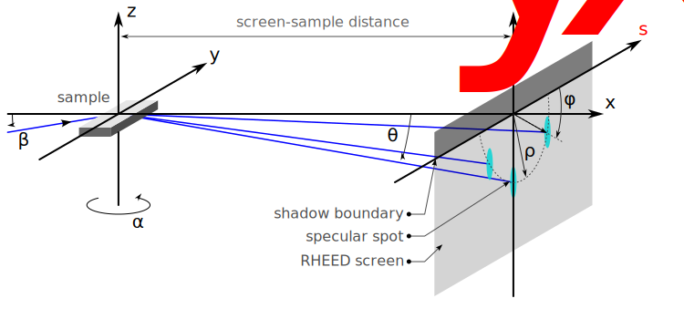
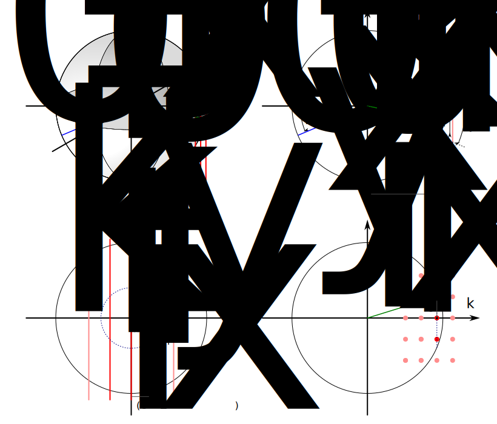

xRHEED geometry
=======================

The geometry used in the xrheed software is shown in the sketch below.

It is important to note that, for convenience, we use two coordinate systems.
The x-y-z system is centered at the sample position (with z normal to the sample surface).
On the RHEED screen, X-Y coordinates are defined with the Y direction pointing upward, which means that the RHEED image appears for negative Y values, below the X axis, as is typical in a RHEED geometry with the sample facing downward (for example, towards effusion cells).

- :math:`\alpha` - azimuthal orientation of the sample
- :math:`\beta` - incident angle of the electron beam (with respect to the x axis)

Ewald construction
------------------

The reciprocal lattice of a 2D real lattice has a form of regularly distributed rods that are normal to a crystal surface plane.
The diffraction spots are expected in the directions that are defined by the intersection points of the Ewald sphere and the rods,
as shown on the sketch bellow.

While it is a common practice to show the sample, the screen and Ewald construction on the same sketch, it is misleading while this mixes real and reciprocal dimensions.

   