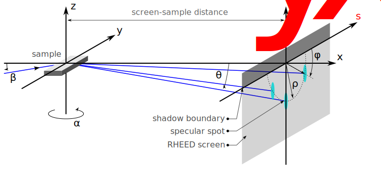

Geometry
========

The schematic below illustrates the experimental geometry employed in the
**xRHEED** package:

The geometry is described using a primary laboratory Cartesian coordinate
system together with a secondary, spherical-like angular parametrization.

Primary coordinate system
-------------------------

The global laboratory coordinate system is Cartesian and right-handed:

- :math:`z` points upward and is anti-parallel to the sample surface normal
  (the sample surface faces downward),
- :math:`x` lies in the horizontal plane and points from the sample toward the
  screen,
- :math:`y` completes the right-handed system.

Incident angle
--------------

- :math:`\beta` is the **incident angle** (also referred to as the
  **glancing angle**) between the incoming electron beam and the sample surface
  plane.

Azimuthal sample rotation
-------------------------

- :math:`\alpha` is the **azimuthal angle**, describing a rotation of the
  sample about the global :math:`z` axis.
- Positive :math:`\alpha` follows the right-hand rule.
- This rotation is independent of the diffraction-angle parametrization
  described below.

Spherical-like diffraction angles
---------------------------------

The diffraction directions are parametrized using the angles
:math:`\theta` and :math:`\varphi` in a **spherical-like coordinate system**
that is not identical to standard spherical coordinates.

In this parametrization:

- the global :math:`x` axis plays the role of the **polar axis**
  (analogous to :math:`z` in conventional spherical coordinates),
- :math:`\theta` is the polar angle measured with respect to the
  :math:`x` axis,
- :math:`\varphi` is the corresponding azimuthal angle measured in the
  plane spanned by the global :math:`y` and :math:`z` axes.

Thus, :math:`\varphi` lies entirely in the :math:`y\!-\!z` plane.

Screen geometry and coordinates
-------------------------------

The screen plane is perpendicular to the global :math:`x` axis.

The screen coordinate :math:`S_x` is parallel to the global :math:`y` axis,
and :math:`S_y` is parallel to the global :math:`z` axis. Therefore, for a
sample facing downward, the RHEED image is typically defined for negative
:math:`S_y` values only, with :math:`S_y = 0` corresponding to the shadow
boundary.